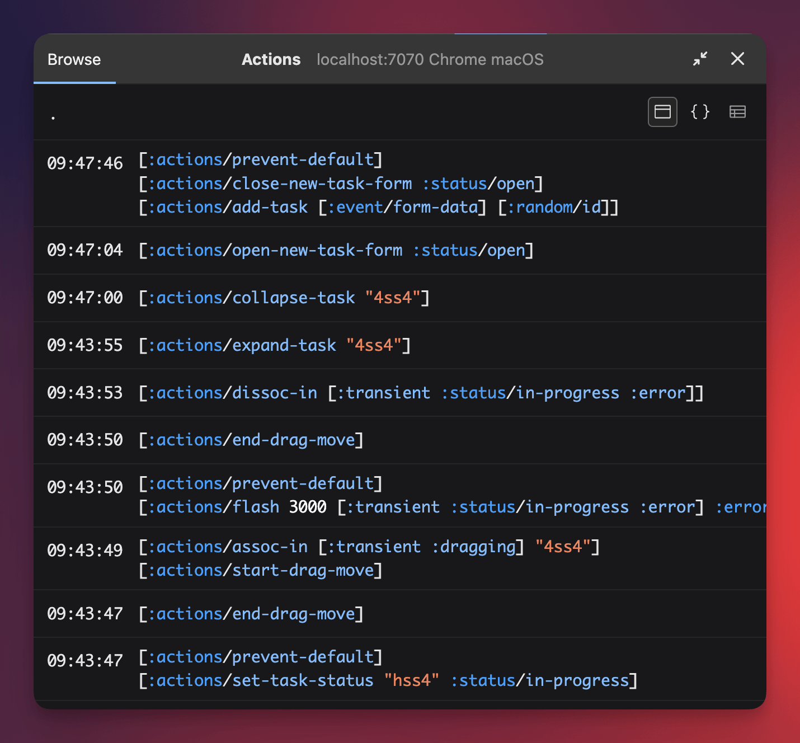
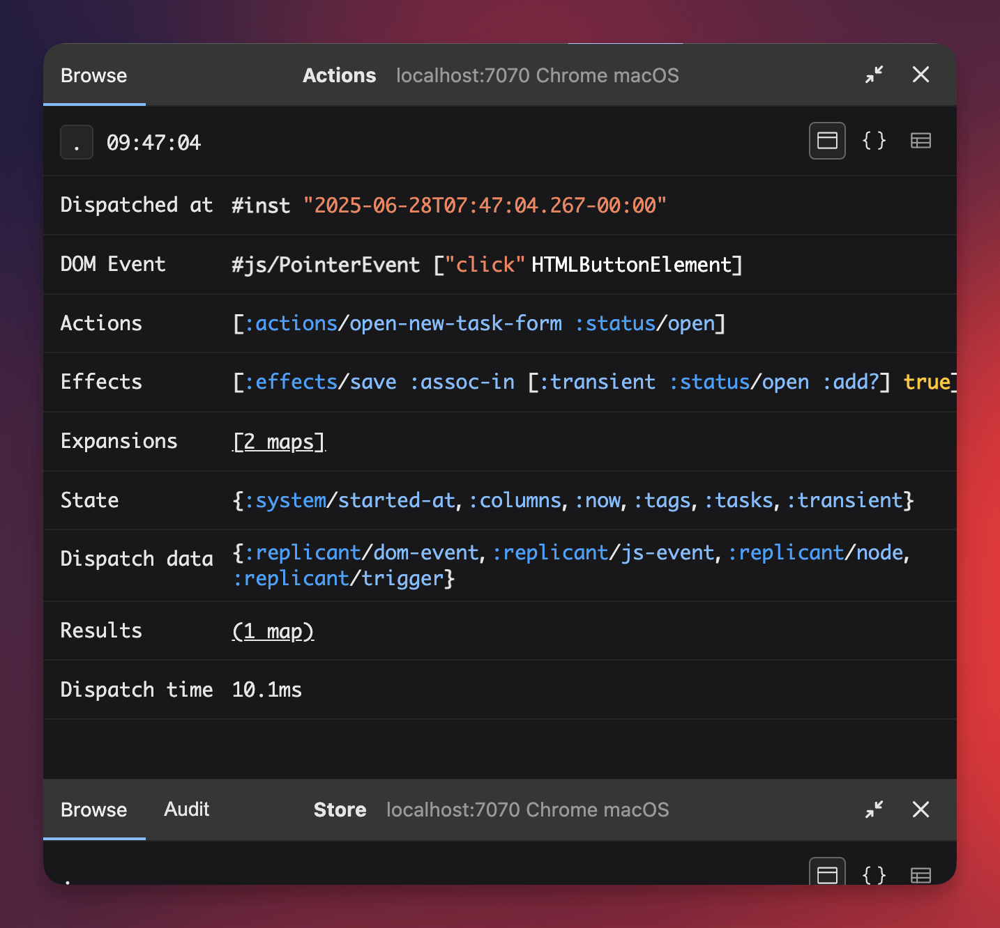

# Nexus

>*noun*<br>
>a means of connection; tie; link.

The UI is a pure function of application state — but event handling can be
messy. It doesn’t have to be. Good event handling is declarative, minimal, and
keeps side-effects well contained.

Nexus is a small, zero-dependency library for dispatching **actions** — data
describing what should happen — with mostly pure functions.

```clj
no.cjohansen/nexus {:mvn/version "2025.10.2"}
```

[Replicant](https://replicant.fun) provides a data-driven and functional
solution to rendering. By making event handlers representable as data, it
provides you with just enough infrastructure to build a declarative action
dispatch system. Nexus is designed to be that system.

## Table of contents

- [Nexus at a glance](#first-example)
- [Getting started](#getting-started)
- [Development tooling](#dev-tooling)
- [Convenience API](#convenience)
- [Rationale](#rationale)
- [Nomenclature](#nomenclature)
- [Error handling](#error-handling)
- [Interceptors](#interceptors)

<a id="first-example"></a>
## Nexus at a glance

Here's a compact showcase of using Nexus with Replicant. Read on for a detailed
introduction to how it works.

```clj
(require '[nexus.registry :as nxr])
(require '[replicant.dom :as r])

(defn save [_ store path value]
  (swap! store assoc-in path value))

(defn increment [state path]
  [[:effects/save path (+ (:step state) (get-in state path))]])

(defn render [state]
  [:div
   [:p "Number: " (:number state)]
   [:div
    [:label "Step size: "]
    [:input
     {:value (:step state)
      :on
      {:input
       [[:effects/save [:step] [:fmt/number [:event.target/value]]]]}}]]
   [:button.btn
    {:on {:click [[:actions/inc [:number]]]}}
    "Count!"]])

;; App state
(def store (atom {}))

;; Handle user input: register effects, actions and placeholders.
;; If you don't like registering these globally, the next section
;; shows how to use nexus.core, which has no implicit state.
(nxr/register-effect! :effects/save save)
(nxr/register-action! :actions/inc increment)

(nxr/register-placeholder! :event.target/value
  (fn [{:replicant/keys [dom-event]}]
    (some-> dom-event .-target .-value)))

(nxr/register-placeholder! :fmt/number
  (fn [_ value]
    (or (some-> value parse-long) 0)))

(nxr/register-system->state! deref)

;; Wire up the render loop
(r/set-dispatch! #(nxr/dispatch store %1 %2))
(add-watch store ::render #(r/render js/document.body (render %4)))

;; Trigger the initial render
(reset! store {:number 0, :step 1})
```

<a id="getting-started"></a>
## Getting started

Nexus *actions* are data structures that describe what your system should do.
They're processed as effects—functions that perform side-effects. Actions can
originate from user events, timers, network responses, or other sources.

Actions are vectors of an action type (keyword) and optional arguments:

```clj
[:task/set-status "tid33" :status/in-progress]
```

Effects are functions that process actions and perform side effects on your
system. They are called with two or more arguments: a context map (we'll look at
this later), your *system*, and any arguments from the action.

Nexus makes no assumptions about what the *system* is—you will pass it when
dispatching actions. In this example we'll use an atom, called the `store`.

### Implementing an effect

Put action implementations in your `nexus` map:

```clj
(def nexus
  {:nexus/effects
   {:task/start-editing
    (fn [_ store task-id]
      (swap! store assoc-in [:tasks task-id :task/editing?] true))}})
```

When the action is triggered, e.g. by a DOM event, dispatch it with the `nexus`
map and your system:

```clj
(require '[nexus.core :as nexus])

(def store (atom {:tasks [,,,]}))
(nexus/dispatch nexus store {} [[:task/start-editing "tid33"]])
```

This separates what happens from how, but we can do better—by separating pure
action logic from effectful execution.

In Kanban, there are limits to how many tasks you can have in each column at the
same time, meaning that the `:task/set-status` action is not just a mere
`assoc-in`. This action needs to check how many tasks we already have with the
desired status, and either update the task or flag an error:

```clj
(defn get-tasks-by-status [state status]
  (->> (vals (:tasks state))
       (filter (comp #{status} :task/status))))

(defn get-status-limit [state status]
  (get-in state [:columns status :column/limit]))

(def nexus
  {:nexus/effects
   {:task/start-editing
    (fn [_ store task-id]
      (swap! store assoc-in [:tasks task-id :task/editing?] true))

    :task/set-status
    (fn [_ store task-id status]
      (if (< (count (get-tasks-by-status @store status))
             (get-status-limit @store status))
        (swap! store assoc-in [:tasks task-id :task/status] status)
        (swap! store assoc :errors [:errors/at-limit status])))}})
```

Holy swap, Batman! That's a lot of side-effects in one place. Our goal is to
isolate logic in pure functions, so we can test, reuse, and compose behavior
without changing the world. Let's fix that.

### Pure actions

We will first introduce a low-level effect to update the application state:

```clj
(def nexus
  {:nexus/effects
   {:effects/save
    (fn [_ store path v]
      (swap! store assoc-in path v))}})
```

Our two actions can now be expressed in terms of this one effect. We do that by
implementing them as _actions_ instead of _effects_. Actions are pure functions
that return lists of actions — transforming intent into more low-level
implementations. They're called with an immutable snapshot of your system. This
means we need to tell Nexus how to acquire the system snapshot. Since our system
is an atom, `deref` will do the job just fine:

```clj
(def nexus
  {:nexus/system->state deref ;; <==
   :nexus/effects {,,,}
   :nexus/actions             ;; <==
   {:task/start-editing
    (fn [state task-id]
      [[:effects/save [:tasks task-id :task/editing?] true]])

    :task/set-status
    (fn [state task-id status]
      (if (< (count (get-tasks-by-status state status))
             (get-status-limit state status))
        [[:effects/save [:tasks task-id :task/status] status]]
        [[:effects/save [:errors] [:errors/at-limit status]]]))}})
```

Now we also have clean separation between pure business logic and the
side-effects. Your app will only ever need a handful of effect implementations;
as your app grows you'll be adding action implementations. Nothing but pure
functions all the way, baby!

It's also worth noting that the UI doesn't need to know whether the actions it
dispatches are directly processed as effects, or if it goes through one or more
pure transformations. This allows you to start small and grow your system on
demand, with very little boilerplate.

### Using dispatch data

When using Replicant event handler data, you include actions in the rendered
hiccup. However, some actions rely on data that isn't available until they
dispatch.

Consider this action that updates the task title:

```clj
[:input
  {:placeholder "Task title"
   :name "task/title"
   :on {:input [[:task/update-title task-id ???]]}}]
                                            ^^^
```

To dispatch this we need the `value` from the input field _at the time of
dispatch_. Placeholders solve this problem in a declarative way:

```clj
[:input
  {:placeholder "Task title"
   :name "task/title"
   :on {:input [[:task/update-title task-id [:event.target/value]]]}}]
```

`[:event.target/value]` is a placeholder to be resolved during dispatch.
Placeholders are implemented by the keyword:

```clj
(def nexus
  {:nexus/system->state deref
   :nexus/effects {,,,}
   :nexus/actions {,,,}
   :nexus/placeholders        ;; <==
   {:event.target/value
    (fn [dispatch-data]
      (some-> dispatch-data :dom-event .-target .-value))}})
```

Where does `dispatch-data` come from? It is the third argument to
`nexus.core/dispatch`:

```clj
(nexus/dispatch nexus store {:dom-event ,,,}
 [[:task/update-title "tid33" [:event.target/value]]])
```

#### Calling event methods

Dispatch data is also available to effect functions. Let's say we have a form to
edit the task. Instead of controlling each input, it will use the form submit
action. To avoid a page refresh on submit we must call `.preventDefault` on the
event:

```clj
[:form
 {:on
  {:submit
   [[:effects/prevent-default]
    [:task/edit task-id [:event.target/form-data]]]}}
 ,,,]
```

Effect functions receive `dispatch-data` as part of their first argument, the
aforementioned context map:

```clj
(def nexus
  {,,,
   :nexus/effects
   {,,,
    :effects/prevent-default
    (fn [{:keys [dispatch-data]} _]
      (some-> dispatch-data :dom-event .preventDefault))}})
```

#### Clock time

You may want to record the time of the last edit. However, getting the current
time in the action handler means it's no longer pure (and will make it much
harder to test). You can solve this by passing in the current time.

One way to achieve this is to use another placeholder:

```clj
(def nexus
  {,,,
   :nexus/placeholders
   {,,,
    :clock/now
    (fn [{:keys [now]}]
      now)}})

(nexus/dispatch nexus store {:dom-event ,,,
                             :now (js/Date.)}
 [[:task/update-title "tid33" [:event.target/value] [:clock/now]]])
```

Note that you could write this placeholder very succinctly:

```clj
(def nexus
  {:nexus/placeholders
   {:clock/now :now}})
```

Another option is to make sure the state always has the current time on it:

```clj
(def nexus
  {,,,
   :nexus/system->state
   (fn [store]
     (assoc @store :clock/now (js/Date.)))
   :nexus/actions
   {:task/edit
    (fn [state task-id data]
      (into [[:effects/save [:tasks task-id :task/updated-at] (:clock/now state)]]
            (for [[k v] data]
              [:effects/save [:tasks task-id k] v])))}})
```

#### Nested placeholder

You may have wondered why the placeholder keyword is wrapped in a vector:
`[:event.target/value]`. The vector allows placeholders to nest, so you can
transform late bound values without having to litter your code with things like
`parse-long`, or duplicate placeholders, e.g. `:event.target/value-as-*`.

Let's say you wanted to get a number from an input field:

```clj
[:input
 {:on
  {:input
   [[:task/set-order task-id [:fmt/long [:event.target/value]]]]}}]
```

The `:fmt/long` placeholder takes an argument, which is passed to the
placeholder function:

```clj
(def nexus
  {,,,
   :nexus/placeholders
   {:event.target/value
    (fn [{:keys [dom-event]}]
      (some-> dom-event .-target .-value))

    :fmt/long
    (fn [_ val]
      (or (some-> val parse-long) 0))}})
```

### Batching effects

`:task/edit` emits multiple `:effects/save` actions. With the current
implementation, this will cause several calls to `swap!`. If you want action
dispatch to be atomic, you can _batch_ `:effects/save`. To do this, mark the
function with `:nexus/batch` meta data, and change its signature. It will now
receive a collection of action arguments:

```clj
(def nexus
  {,,,
   :nexus/effects
   {:effects/save
    ^:nexus/batch
    (fn [_ store path-vs]
      (swap! store
       (fn [state]
         (reduce (fn [acc [path v]]
                   (assoc-in acc path v))
                 state path-vs))))}})
```

With this minor change, every `:effects/save` will be handled together,
resulting in only a single `swap!`.

### Asynchronous effects

Imagine that there is a form to add new tasks. When the form is submitted, we
want to issue a command to the server to create a new task, and redirect the
user to a dedicated page for it.

Here's an effect to send a command to the server:

```clj
(def nexus
  {:nexus/effects
   {:effects/command
    (fn [ctx store command]
      (js/fetch "/commands"
                #js {:method "POST"
                     :body (pr-str command)}))}})
```

To redirect the user, we need to dispatch a new action when the command
completes, looking up the new location from the response. The `ctx` passed to
effect functions includes a `:dispatch` function. It lets you trigger new
actions with access to the same `nexus`, `system` and `dispatch-data`.

```clj
(def nexus
  {:nexus/effects
   {:effects/command
    (fn [{:keys [dispatch]} store command]
      (-> (js/fetch "/commands"
                    #js {:method "POST"
                         :body (pr-str command)})
          (.then
           (fn [response]
             (dispatch
              [[:effects/navigate
                (.get (.-headers response) "Location")]])))))}})
```

This works, but it couples concerns more tightly than we'd like. We want as few
effects as possible, meaning that they should be as general as possible. We
can't assume that every command should result in a navigation. Instead we want
to make this decision when issuing the command:

```clj
(nexus/dispatch nexus store dispatch-data
 [[:effects/command
   {:command/kind :commands/create-task
    :command/data
    {:task/title "Learn Nexus"
     :task/priority :task.priority/high}}
   {:on-success [[:effects/navigate ???]]}]])
                                    ^^^
```

Once again, we want to refer to a value that’s only available when the action is
triggered—without writing imperative glue code. Unfortunately we can't just
stick a placeholder here, as it would resolved immediately upon dispatching
`:effects/command` -- there is no way for Nexus to know that `:on-success`
describes something that should happen later.

This problem needs a custom solution in your app. One possibly solution is to
use a placeholder anyway, and implement it such that it preserves the
placeholder when there is not yet a value to replace it with:

```clj
(def nexus
  {:nexus/placeholders
   {:http.res/header
    (fn [{:keys [response]} header]
      (if response
        (.get (.-headers response) header)
        [:http.res/header header]))}})
```

We can use the placeholder in the `:on-success` actions:

```clj
[[:effects/command
  {:command/kind :commands/create-task
   :command/data
   {:task/title "Learn Nexus"
    :task/priority :task.priority/high}}
  {:on-success [[:effects/navigate [:http.res/header "Location"]]]}]]
```

Finally, in the command effect, we can provide _additional dispatch data_ when
dispatching new actions. This dispatch data will be merged into the original
dispatch data:

```clj
(def nexus
  {:nexus/placeholders
   {:http.res/header
    (fn [{:keys [response]} header]
      (.get (.-headers response) header))}

   :nexus/effects
   {,,,
    :effects/command
    (fn [{:keys [dispatch]} store command {:keys [on-success]}]
      (-> (js/fetch "/commands"
                    #js {:method "POST"
                         :body (pr-str command)})
          (.then
           (fn [response]
             (when on-success
               (dispatch on-success {:response response}))))))}})
```

The effect function now accepts a fourth argument that matches the extra options
in the dispatched action:

```clj
[:effects/command command opts]
```

For a production-ready setup you should also support an `:on-failure` option in
the last map.

With this setup, we’ve cleanly separated concerns: the command effect remains
generic, while callers can declaratively define what should happen on success.
This pattern generalizes well and can be used to implement all kinds of
asynchronous flows.

## Putting it together

If you're rendering with Replicant, you can introduce it to Nexus with a
one-liner:

```clj
(require '[nexus.core :as nexus]
         '[replicant.dom :as r])

(def nexus ,,,)
(def store (atom {}))

(defn start [el neus store]
  ;; Dispatch Replicant's event data with Nexus
  (r/set-dispatch! #(nexus/dispatch nexus store %1 %2))
  (add-watch store ::render #(r/render el %4))
  (swap! store assoc ::started-at (js/Date.)))
```

`set-dispatch!` calls its function with a map that contains, among other things,
the DOM event under the key `:replicant/dom-event`.

<a id="dev-tooling"></a>
## Development tooling

> ...if only you could see what I've seen with your eyes

If you are using [Dataspex](https://github.com/cjohansen/dataspex) you can load
Nexus' custom action panel like so:

```clj
(require '[nexus.action-log :as action-log])

(defn inspect-actions [nexus]
  (let [log (action-log/create-log)]
    (action-log/install-inspector log)
    (action-log/install-logger nexus log)))
```

...and use the returned `nexus` with `nexus/dispatch`.

<div align="center">
  
  
</div>

<a id="convenience"></a>
## Give me convenience, or give me death

Compiling the `nexus` map and passing it by hand makes things explicit at the
cost of some boilerplate on your end. Maybe you're willing to swallow a little
implicitness for a lot of convenience? Then `nexus.registry` is for you.

`nexus.registry` provides some wrappers that collect actions, effects and
placeholders in a global registry:

```clj
(require '[nexus.registry :as nxr])

(nxr/register-effect! :effects/save
  ^:nexus/batch
  (fn [_ store path-vs]
    (swap! store
     (fn [state]
       (reduce (fn [acc [path v]]
                 (assoc-in acc path v))
               state path-vs)))))

(nxr/register-placeholder! :event.target/value
  (fn [{:replicant/keys [dom-node]}]
    (some-> dom-node .-target .-value)))

(nxr/register-placeholder! :fmt/number
  (fn [_ val]
    (or (some-> val parse-long) 0)))

(nxr/register-action! :task/start-editing
  (fn [state task-id]
    [[:effects/save [:tasks task-id :task/editing?] true]]))

(nxr/register-action! :task/set-status
  (fn [state task-id status]
    (if (< (count (get-tasks-by-status state status))
           (get-status-limit state status))
      [[:effects/save [:tasks task-id :task/status] status]]
      [[:effects/save [:errors] [:errors/at-limit status]]])))

,,,
```

`nexus.registry/dispatch` implicitly uses this registry:

```clj
(replicant.dom/set-dispatch!
 (fn [dispatch-data actions]
   (nxr/dispatch store dispatch-data actions)))
```

Using the global registry makes the dev setup much easier, because you don't
need to coordinate on the `nexus` map. Just add this to your development setup:

```clj
(require '[nexus.action-log :as action-log])

(action-log/inspect)
```

## Rationale

[Tutorials on the Replicant
website](https://replicant.fun/tutorials/state-atom/) demonstrate that rolling
your own action dispatch system is not a big undertaking. So why does this
library exist?

### Lower barrier to entry

Designing a robust action dispatch system can be daunting when you’re just
getting started. Even if the pieces are conceptually simple, it takes time and
experience to get the architecture right, especially in a functional setting.

We’ve spent over a decade building systems like this in Clojure. Nexus is our
distilled take on how to do it cleanly and consistently, so you don’t have to
reinvent the wheel or get stuck figuring it out on day one.

Even for experienced developers, it’s easy to cut corners when wiring up yet
another dispatch system—skipping instrumentation, half-assing some features, or
going light on error handling. Nexus takes care of those finer points once and
for all.

### Standardized data flow

Every app needs some kind of action dispatch system. Even if we all agree that
an action is a vector with a keyword identifier and some arguments, there are
many ways to build the dispatch pipeline. There’s little value in making it
slightly different in every project—but doing so does come with a cognitive
cost.

You need _some_ action system from the very beginning—often before you know if
you’ll need to separate actions from side-effects, if actions will need to
trigger other actions (maybe asynchronously), or if you’ll want placeholder
interpolation.

If we can build a strong, flexible system for this flow in a small package, it
can help reduce decision fatigue and free up your mental bandwidth to focus on
your domain instead of your wiring.

### Reduced boilerplate

Sure, a basic dispatch system isn’t much code—but it is code you’ll end up
copying between projects. With Replicant and Nexus together, you get up and
running with just a handful of lines. That means less setup, fewer errors, and
more consistency across projects.

### Strong developer tooling

Action dispatch is one of those areas where good observability is a genuine
superpower. Nexus ships with built-in integration for
[Dataspex](https://github.com/cjohansen/dataspex), letting you inspect dispatch
flows live during development.

It also exposes a fine-grained interceptor API you can extend however you
want—add production tracing, connect it to custom tooling, or build your own
time-travel debugger.

----

We’re not trying to scare you into using a library when 50 lines of code could
work. But for ~160 lines, Nexus gives you a clean, tested, extensible dispatch
system with excellent dev tooling built in.

## Nomenclature

Finding the right nomenclature was the most important part of the Nexus design
process. Strong names empower you to build a system with the right focus, help
you reach for the right tools for the job, and lightens the learning curve.

### Action

A vector beginning with a keyword (e.g. `[:auth/login "alice" "secret"]`) that
represents an instruction to the system. The keyword identifies the action type,
and any following values are action arguments.

Actions were deliberately not named "events" for two reasons:

1. Events describe something that occurred that the system may or may not want
   to react to. This is much too indirect for describing the result of clicking
   a button. When clicking a button we don't have a "clicked login-button"
   event, we have a "login" action - a clear instruction to the system.
2. The word "event" is already heavily loaded in the context of a browser. In
   fact, actions typically will be dispatched in reaction to a DOM event. Having
   multiple different artifacts that are all named event does not make
   writing code easier.

Action handlers are pure functions that take the state (see below) and any
arguments from the action, and return a list of new actions.

### Effect

When an action reaches an effect handler to be processed for its side-effects,
we call it an effect. In other words, "effect" and "action" describe the same
data structure in different phases of processing.

An effect handler is a function that receives `ctx`, the live system and any
action arguments and uses them to perform side-effects:

```clj
[:effect/save [:number] 3]

(fn [ctx system path value])
```

Here `path` would be bound to `[:number]` and `value` to `3`.

When effect functions are batched, they receive a collection of arguments
instead:

```clj
[[:effect/save [:number] 3]
 [:effect/save [:name] "Nexus"]]

^:nexus/batch
(fn [ctx system path-values])
```

In this case `path-values` would be:

```clj
[[[:number] 3]
 [[:name] "Nexus"]]
```

### System

The system contains your live, mutable application state and services. Nexus
treats this as an opaque value—it never inspects or modifies it. It is passed to
effects (to perform work) and to your `:nexus/system->state` function (to
extract pure data for action handlers).

### State

The result of calling `:nexus/system->state` on your system. The result is
assumed to be immutable data.

### Dispatch data

Data that is only available at the time an action is dispatched. Prime examples
include the DOM event that triggered the action or the target element, but can
be anything a pure action handler wouldn't otherwise have access to, like the
current time.

### Placeholder

Placeholders allow actions to refer to data that isn't available until the
action is dispatched. They are represented as a vector with a keyword, and
possibly additional arguments. Placeholders have an implementation associated
with the first keyword.

### `nexus`

A map defining your Nexus system. It includes keys like `:nexus/actions`,
`:nexus/effects`, `:nexus/placeholders`, `:nexus/interceptors`, and
`:nexus/system->state`. This is the central registry passed to
`nexus.core/dispatch`.

When using `nexus.registry`, Nexus maintains this registry for you.

### `ctx`

The context map passed to interceptors. It contains data relevant to the current
interceptor phase (e.g. `:action`, `:errors`, `:results`) and data about other
interceptors (`:queue`/`:stack`). Interceptors can read or modify this context
to influence execution.

## Error handling

Nexus catches errors from handlers and interceptors, and propagates them as
data. By default, a dispatch can be partially successful—some actions may
complete while others fail in an action or effect handler. You can control this
behavior with [interceptors](#interceptors). Nexus ships with an opt-in fail
fast strategy if you'd like all action and effect processing to halt on the
first error:

```clj
(require '[nexus.strategies :as strategies])

(def nexus
  {:nexus/interceptors [strategies/fail-fast]
   :nexus/actions ,,,
   :nexus/effects ,,,})
```

If you're using the registry:

```clj
(require '[nexus.registry :as nxr])
(require '[nexus.strategies :as strategies])

(nxr/register-interceptor! strategies/fail-fast)
```

With the fail-fast strategy, action and effect processing stops at the first
failure. `dispatch` itself will never throw. Errors are collected and returned
in the `:errors` key. If you want an exception thrown on error, you can do that
after calling `dispatch`:

```clj
(require '[nexus.core :as nexus])

(let [{:keys [results errors]} (nexus/dispatch nexus actions)]
  (when-let [error (->> errors (keep :err) first)]
    (throw error)))
```

Note that this will only throw the first of potentially several errors.

## Interceptors

Interceptors let you instrument and control the flow of actions. They can run
before or after dispatch, action handlers, and effect handlers.

An interceptor is a map with an `:id` and any number of phase functions, keyed
by:

- `:before-dispatch`
- `:after-dispatch`
- `:before-action`
- `:after-action`
- `:before-effect`
- `:after-effect`

All interceptor functions take a single argument, `ctx`, and must return an
updated `ctx`. Its contents vary by phase, but always include:

- `:queue` — the remaining before-phase interceptors. The handler function
  appears at the end of this list.
- `:stack` — the after-phase interceptors to run once the handler completes.

By modifying `:queue` or `:stack`, interceptors can short-circuit processing or
skip specific interceptors.

Specific arguments passed to the various phase functions:

### `:before-dispatch`

- `:system`
- `:state`
- `:dispatch-data`
- `:actions`

### `:after-dispatch`

- `:system`
- `:state`
- `:dispatch-data`
- `:actions`
- `:results`
- `:errors`

### `:before-action`

`:before-action` is only called for actions that have a registered action
handler. Any action that only has an effect handler will not be visible with
this interceptor.

- `:state`
- `:action`
- `:errors` (errors from previous action handlers)

### `:after-action`

- `:state`
- `:actions`
- `:errors` (errors from previous action handlers)

### `:before-effect`

- `:system`
- `:dispatch-data`
- `:dispatch` — a function to dispatch new actions with the same `nexus`,
  system, and dispatch-data.
- `:effect` or `:effects` (batched effect handler)
- `:errors` (errors from previous effect handlers)
- `:results` (from previous effects)

### `:after-effect`

- `:system`
- `:dispatch-data`
- `:dispatch`
- `:effect` or `:effects` (batched effect handler)
- `:errors`
- `:results`

### Example: logging

Here's an example of an interceptor that logs actions as they're processed as
effects:

```clj
(def logger
  {:id :logger

   :before-effect
   (fn [{:keys [effect]}]
     (println "Handling effect:" (pr-str effect))
     ctx)

   :after-effect
   (fn [{:keys [effect errors]}]
     (if (seq errors)
       (println "⚠️  Errors while handling" (pr-str effect) ":" (pr-str errors))
       (println "✓ Successfully handled" (pr-str effect)))
     ctx)})

(def nexus
  {:interceptors [logger]
   :actions ,,,
   :effects ,,,})
```

You can also register interceptors with `nexus.registry/register-interceptor!`.

## Nexus in the wild

**Ring middleware:** [ring-nexus-middleware](https://github.com/ovistoica/ring-nexus-middleware) applies Nexus to Ring handlers for clean, testable web applications.
**Datastar:** [datastar.wow](https://github.com/brianium/datastar.wow) uses Nexus to create extensible, testable, and data-oriented real-time applications via [Datastar](https://data-star.dev/).

## Acknowledgments

Designed by [Magnar Sveen](https://magnars.com) ([@magnars](https://github.com/magnars)),
[Christian Johansen](https://cjohansen.no) ([@cjohansen](https://github.com/cjohansen)), and
[Teodor Heggelund](https://play.teod.eu/) ([@teodorlu](https://github.com/teodorlu)).

## Changelog

### 2025.10.2

Fixed a bug with interpolation accidentally introduced in 2025.10.1 ([Martin
Solli](https://github.com/msolli)).

### 2025.10.1

Interpolate placeholders in between each action expansion.

## License: MIT

Copyright © 2025 Christian Johansen, Magnar Sveen, and Teodor Heggelund.
Distributed under the [MIT License](https://opensource.org/license/mit).
